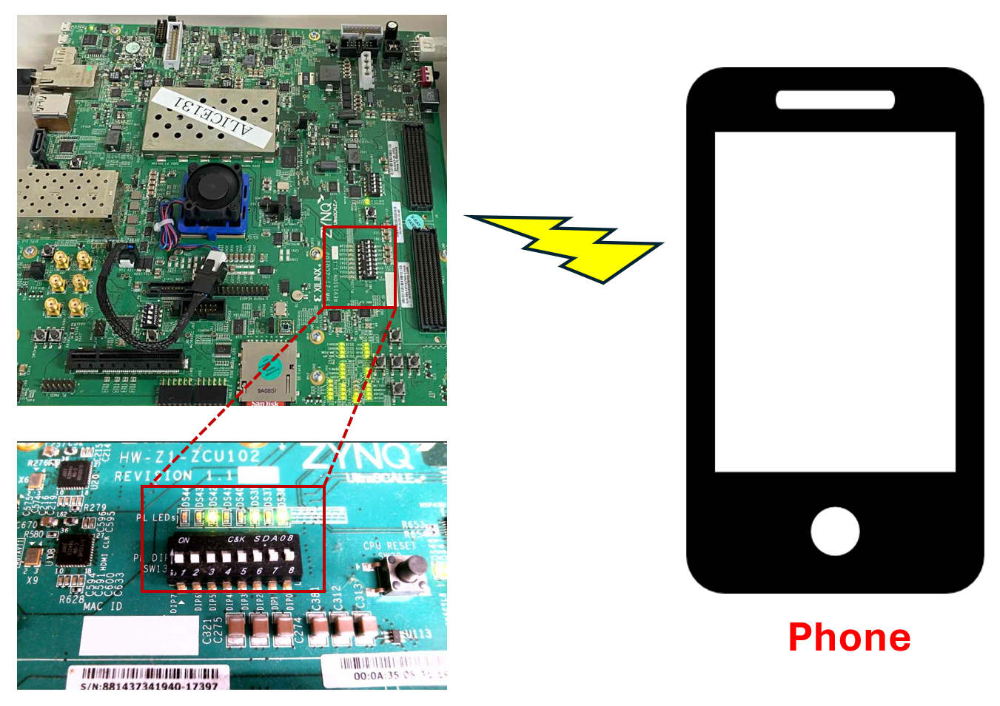

## FPGA_LED_Control_via_Phone

### Introduction
This project demonstrates how to control LEDs on the ZCU102 FPGA board using a smartphone through a Node.js web server. The design leverages the SoC capability of the ZCU102 board, running PetaLinux for embedded Linux operation. The C program directly accesses and controls an IP core connected to LED pins, while Node.js handles remote web requests and triggers the C control functions.

### Setup
The following figure shows the overall setup, including the connection between the smartphone, web server, and FPGA board.

### Video Tutorial
The full tutorial is divided into two parts:
- [Part 1: System Setup and PetaLinux Overview](https://youtu.be/NQ5qTkZTr5I)
- [Part 2: Node.js Server and C Code Integration](https://youtu.be/UQM3CLi0w9A)

### System Overview
1. **Hardware Platform:** Xilinx ZCU102 SoC FPGA  
2. **Operating System:** PetaLinux (embedded Linux)  
3. **Programming Languages:** C (for LED control) and JavaScript (Node.js server)  
4. **Interface:** Web browser or smartphone to send control commands  
5. **Communication:** Node.js calls C functions using system-level execution

#### Author
Pham Hoai Luan  
Nara Institute of Science and Technology (NAIST), Japan